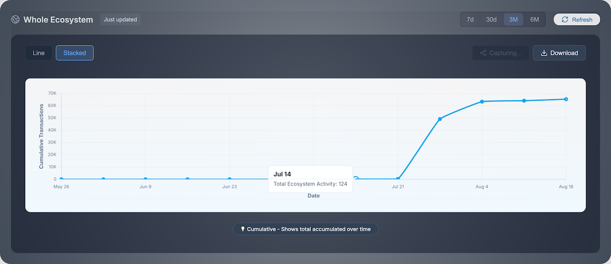
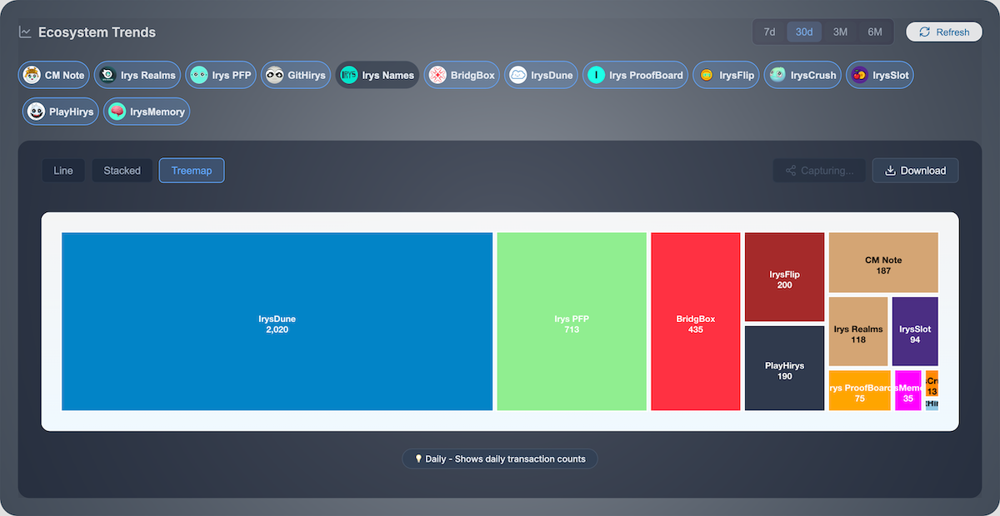

## IrysDune
IrysDune is a platform, where Irys dApp datas are visualized.  Community can talk about Irys dynamically using charts, badges.

### Charts
There are various types of charts that captures Irys dapp activity.

#### Cumulative Transactions

#### dApp Mindshare

#### Social

  
  
  

### Badges
Users can mint badges for their dapp activity and talk about it.

#### Campaign

#### Mission

  
  
  

#### Social

  
  
  

